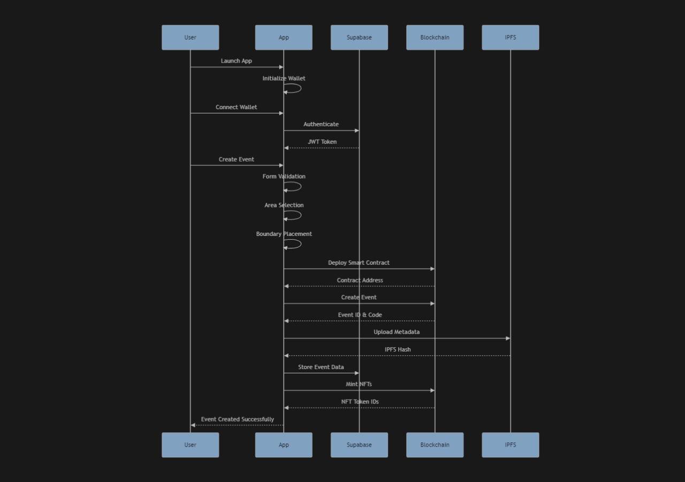

# 🎭 FaceReflector (Tokon) - AR-Powered Event Goodies App

An innovative Flutter application that combines **Augmented Reality (AR)** with **Web3 (Somnia Network)** to create immersive event experiences. Users explore real-world locations through their phone’s camera to discover and claim **virtual goodies (NFTs, tokens, or airdrops)**, making event participation fun, interactive, and memorable.

---

## 🌟 Features

### For Event Organizers
- **Event Creation**: Create events with custom geofenced boundaries.
- **Smart Contract Deployment**: Automated NFT contracts for each event on **Somnia**.
- **Map Integration**: Draw claimable zones on Google Maps.
- **NFT Management**: Configure NFT metadata with **IPFS**.
- **Live Management**: Track event engagement in real time.

### For Event Participants
- **AR Gameplay**: Immersive AR catching system (Pokémon-Go style).
- **Retro Vibes**: Pixel-art inspired collectibles with modern AR.
- **Proximity Detection**: Hints when you’re close to hidden goodies.
- **NFT Claiming**: Catch & mint NFTs directly to your wallet.
- **Wallet Integration**: Connect via **WalletConnect (MetaMask, Core, Trust, Coinbase)**.

---

## 🛠️ Technical Stack

### Mobile (Flutter)
- **Flutter 3.8 (Dart 3)**  
- **State Management**: Riverpod  
- **Routing**: GoRouter  
- **AR**: ARCore/ARKit via `ar_flutter_plugin`  
- **Maps**: Google Maps SDK  

### Backend (Supabase)
- **Database**: PostgreSQL + PostGIS (location queries)  
- **Auth**: Wallet-based authentication  
- **Storage**: Supabase Storage + SQLite offline sync  

### Blockchain (Somnia Network)
- **Network**: Somnia (C-Chain equivalent)  
- **Smart Contracts**: Solidity 0.8, ERC-721 NFTs  
- **Libraries**: OpenZeppelin Security  
- **Metadata**: IPFS (via Pinata)  
- **DevOps**: Hardhat + Ethers.js, GitHub Actions  

### Optimizations
- 60 FPS AR performance  
- Adaptive GPS polling  
- Anti-spoofing & reentrancy protection  
- Spatial indexing for efficient queries  

---

## 📐 Technical Architecture



**Flow**:
1. Player opens AR app → fetches geofenced tokens from Supabase  
2. AR view renders tokens → user interacts via GPS + AR anchors  
3. On claim → transaction sent to **Somnia smart contract**  
4. Token minted as **ERC-721 NFT** with metadata stored on **IPFS**  
5. NFT ownership reflected in connected wallet  

---

## 📜 Contract Addresses (Somnia Testnet)

| Contract        | Address                                    |
|-----------------|--------------------------------------------|
| Event Factory   | `0xf9CF13b978A71113992De2A0373fE76d3B64B6dc` |
| NFT Collection  | `0xbac9dBf16337cAC4b8aBAef3941615e57dB37073` |
| Claim Manager   | `0xB6Ba7b7501D5F6D71213B0f75f7b8a9eFc3e8507` |

*(Update with deployed addresses when available.)*

---

## 🚀 Getting Started

### Prerequisites
- Flutter SDK (≥ 3.8.1)  
- Dart SDK (≥ 3.0)  
- Google Maps API key  
- Supabase account  
- Pinata IPFS account  
- Wallet (MetaMask / Core / Trust)  

### Setup
```bash
git clone https://github.com/yourusername/face_reflector.git
cd face_reflector
flutter pub get
